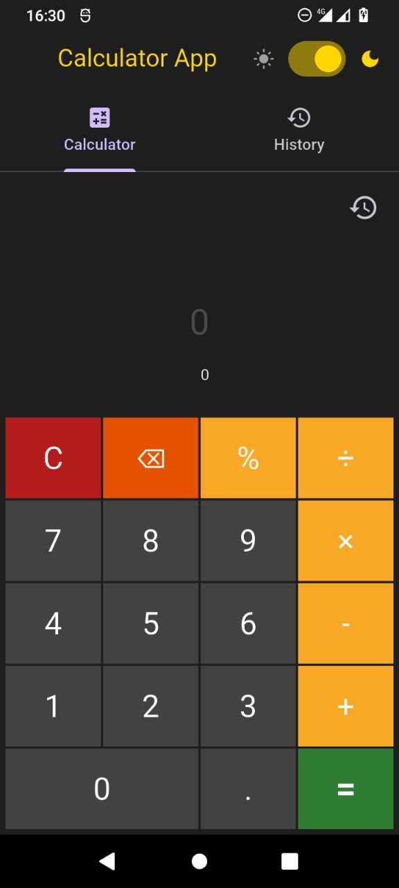

# calculator-mobile

<p align="center">
  
  
</p>

Мобильный калькулятор на Flutter с использованием Riverpod для управления состоянием.

## Возможности

- Базовые арифметические операции: `+`, `-`, `×`, `÷`, `%`
- История вычислений с возможностью повторного использования результата
- Обработка ошибок (например, деление на ноль)

## Стек

- Flutter
- Riverpod (`flutter_riverpod`)
- `math_expressions` для вычисления выражений

## Запуск

```bash
flutter pub get
flutter run
```
